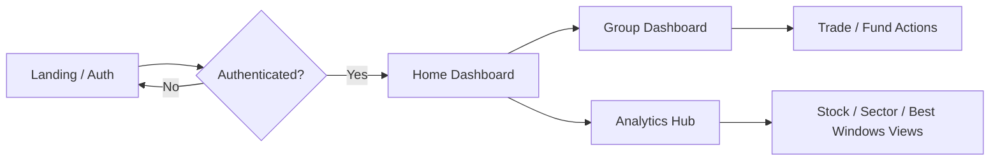
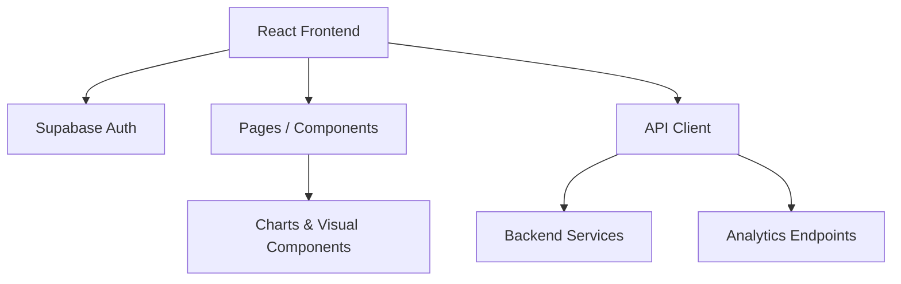

# StoxCircle

StoxCircle is a modern investment collaboration platform designed for traders and investing groups to manage shared portfolios, track performance, and explore market analytics in one place.

This repository currently contains the frontend application for the platform. The UI is built with React + Vite and connects to Supabase for authentication, while group operations and analytics data are fetched from external backend services.

---

## Overview

StoxCircle helps users:
- Create and manage investment circles/groups
- Track members, pool capital, holdings, and trade activity
- Review portfolio performance and PnL metrics
- Explore stock and sector analytics
- Search for symbols and navigate between group/analytics views

The product is aimed at both individual investors and community-driven trading groups who want a more visual and collaborative way to monitor their investing journey.

---

## Key Features

### 1. Group Management
- Create new investment groups
- Join or search for public/private groups
- View members, total capital, and group-level performance
- Approve or reject member join requests

### 2. Portfolio Dashboard
- Monitor holdings and cash balance
- View realized/unrealized PnL
- Open analytics and trade detail modals
- Deposit funds into the group pool

### 3. Trading Operations
- Buy and sell trades
- Review trade history
- View detailed holding information and risk context

### 4. Analytics Hub
- Stock-level analytics
- Sector and universe screening
- Best windows analysis
- Seasonality and excess return insights
- Stop-loss analysis and similar-year comparisons

### 5. Authentication
- Supabase-based auth flow
- Login, signup, and session persistence
- Protected routes for authenticated users

---

## Tech Stack

### Frontend
- React 19
- Vite
- React Router DOM
- Framer Motion
- Recharts
- Phosphor Icons
- CSS custom design system

### Backend Integrations
- Supabase for authentication and session handling
- External REST API for group data and analytics endpoints

### Tooling
- ESLint
- PWA support via Vite PWA plugin

---

## Project Structure

```text
.
├── README.md
└── stoxcircle-frontend/
    ├── package.json
    ├── vite.config.js
    ├── index.html
    ├── public/
    └── src/
        ├── App.jsx
        ├── main.jsx
        ├── index.css
        ├── api/
        │   └── client.js
        ├── components/
        │   ├── Navbar.jsx
        │   ├── GlobalSearch.jsx
        │   ├── Modal.jsx
        │   ├── analytics/
        │   ├── filters/
        │   ├── loaders/
        │   ├── modals/
        │   └── ui/
        ├── hooks/
        │   └── useApi.js
        ├── lib/
        │   └── supabase.js
        ├── pages/
        │   ├── LandingPage.jsx
        │   ├── AuthPage.jsx
        │   ├── Home.jsx
        │   ├── GroupDashboard.jsx
        │   ├── GroupDetail.jsx
        │   ├── AnalyticsHub.jsx
        │   ├── StockAnalytics.jsx
        │   ├── UniverseScreener.jsx
        │   ├── SectorRotation.jsx
        │   ├── BestWindows.jsx
        │   └── SectorAnalysis.jsx
        └── data/
            └── mockData.js
```

---

## Main Application Flow

1. Users land on the marketing page (`/home` or `/`) and can choose to log in or sign up.
2. Authenticated users are routed into the main dashboard experience.
3. The home screen shows the user's group memberships and lets them create new groups.
4. Group dashboards display member data, portfolio metrics, and actions such as funding or trade execution.
5. Analytics pages provide deeper research tools for individual stocks and market sectors.



---

## Routes

| Route | Description |
| --- | --- |
| `/` or `/home` | Landing/marketing page for unauthenticated visitors |
| `/auth` | Login/signup screen |
| `/` (authenticated) | User dashboard with existing groups |
| `/group/:groupId` | Group-specific dashboard |
| `/analytics` | Analytics hub |
| `/analytics/stocks/:symbol` | Stock analytics |
| `/analytics/screener/universe` | Universe screener |
| `/analytics/market/sector-rotation` | Sector rotation analytics |
| `/analytics/best-windows` | Best windows analysis |
| `/analytics/screener/sector` | Sector analysis |

---

## Environment Variables

The frontend expects the following variables to be defined in a `.env` file:

```env
VITE_SUPABASE_URL=your_supabase_url
VITE_SUPABASE_ANON_KEY=your_supabase_anon_key
VITE_SERVER_URL=your_backend_base_url
VITE_ANALYTICS_SERVER_URL=your_analytics_api_base_url
```

Notes:
- `VITE_SUPABASE_URL` and `VITE_SUPABASE_ANON_KEY` are used for authentication.
- `VITE_SERVER_URL` is used for group, dashboard, and trade-related API calls.
- `VITE_ANALYTICS_SERVER_URL` is used for analytics endpoints.

---

## Local Development

### 1. Install dependencies

```bash
cd stoxcircle-frontend
npm install
```

### 2. Configure environment variables

Create a `.env` file in the `stoxcircle-frontend` directory and add the required variables.

### 3. Start the development server

```bash
npm run dev
```

The app will be available at the Vite local URL shown in the terminal.

### 4. Build for production

```bash
npm run build
```

---

## Notes on Architecture

- Authentication is handled through Supabase and the app listens for session changes.
- A custom API client wraps fetch requests and adds the bearer token when available.
- Analytics pages use reusable hooks to fetch data and render charts.
- The app is designed to work with a separate backend service for business logic and analytics.



---

## Contributing

If you want to contribute:
1. Fork the repository
2. Create a feature branch
3. Make your changes
4. Run the project locally
5. Open a pull request with clear notes about what changed

---

## Summary

StoxCircle combines community investing workflows with market analytics into a single dashboard experience. The frontend is well-structured for scaling, and the main areas to extend are analytics modules, portfolio actions, and API integrations.
